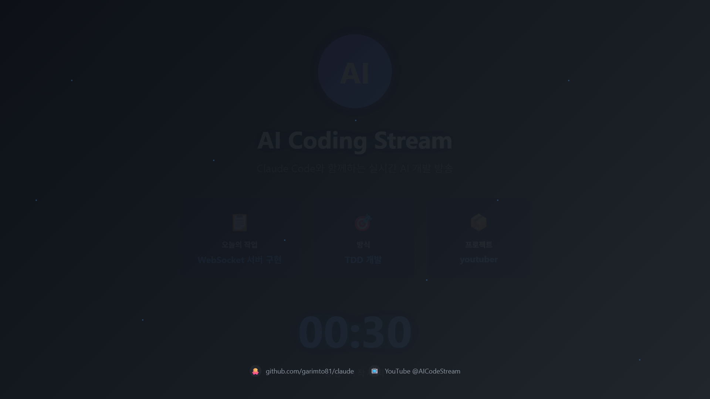
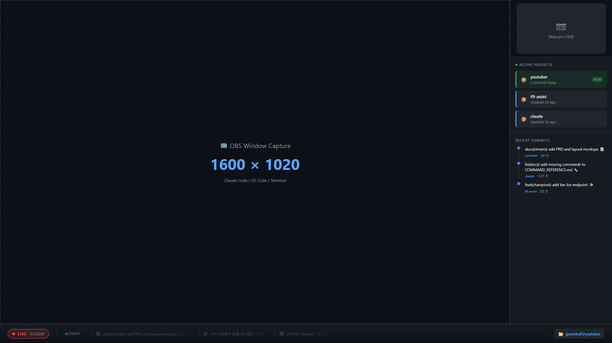
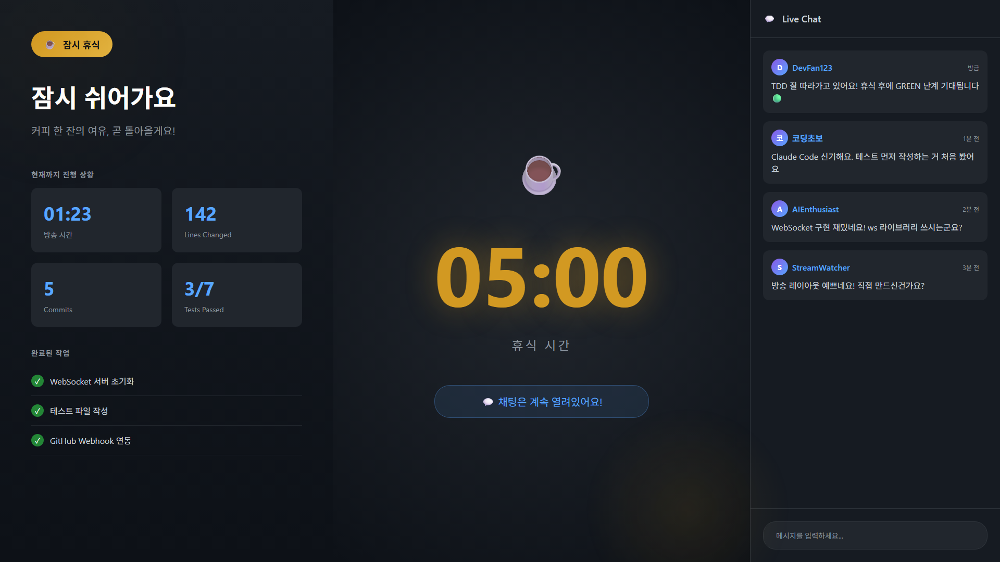
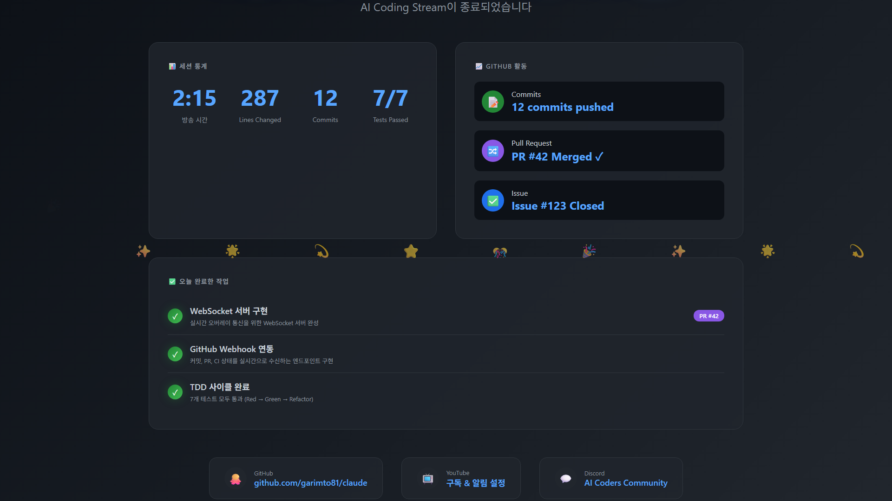

# PRD-0001: AI Coding YouTube 방송 시스템

**버전**: 1.3.0
**작성일**: 2026-01-03
**상태**: Draft
**프로젝트**: `D:\AI\claude01\youtuber`

---

## 1. 개요

### 1.1 목적

Claude Code (CLI) 기반 AI 코딩 작업 과정을 YouTube에서 실시간으로 스트리밍하는 시스템을 구축합니다.
GitHub 연동 자동화와 직관적인 방송 레이아웃을 통해 시청자가 AI 개발 과정을 쉽게 이해할 수 있도록 합니다.

### 1.2 범위

| 항목 | 포함 | 제외 |
|------|------|------|
| 방송 플랫폼 | YouTube | Twitch, 기타 플랫폼 |
| AI 도구 | Claude Code (CLI) | Cursor, Copilot |
| 자동화 | 전체 자동화 | 수동 운영 |
| 상호작용 | 실시간 채팅 응답 | AI 자동 응답 |

### 1.3 오버레이 담당 범위

| 항목 | 담당 | 설명 |
|------|------|------|
| 화면 캡처 | **사용자** (OBS 직접) | Window Capture 등으로 직접 배치 |
| 유튜브 채팅 | **사용자** (유튜브 자체) | 유튜브 라이브 채팅창 사용 |
| 얼굴 캠 영역 | **오버레이** | 320x180, 16:9 플레이스홀더 |
| 프로젝트 상태 패널 | **오버레이** | 320x900, 자동 업데이트 |
| 하단 상태 바 | **오버레이** | 1600x180, TDD/세션 정보 |

---

## 2. 요구사항

### 2.1 기능 요구사항

#### FR-001: 방송 레이아웃 시스템
- 1920x1080 해상도 지원
- 4개 Scene 제공 (Intro, Coding, Break, Ending)
- 실시간 오버레이 업데이트

#### FR-002: GitHub 연동
- 커밋 발생 시 화면에 알림 표시
- CI/CD 상태 실시간 반영
- PR/Issue 상태 표시

#### FR-003: TDD 상태 표시
- Red/Green/Refactor 단계 시각화
- 테스트 통과율 실시간 표시

#### FR-004: 방송 자동화
- PowerShell 스크립트로 방송 시작/종료
- Scene 자동 전환
- 세션 통계 자동 저장

### 2.2 비기능 요구사항

| 항목 | 요구사항 |
|------|----------|
| 지연 시간 | 오버레이 업데이트 < 500ms |
| 안정성 | 2시간 이상 연속 방송 가능 |
| CPU 사용률 | 인코딩 포함 < 50% |

---

## 3. 디자인 명세 (1920x1080)

### 3.1 Scene 1: Intro (방송 시작 전)



**구성요소:**
- 중앙 로고 (200x200px, 그라데이션 원형)
- 타이틀 "AI Coding Stream" (64px, 흰색)
- 오늘의 작업 카드 3개 (280px 너비)
- 카운트다운 타이머 (120px)
- 하단 소셜 링크

**용도:** 방송 시작 30초 전부터 표시

---

### 3.2 Scene 2: Coding (메인 코딩 화면) - v3



**설계 원칙 (v3 개선):**
- **미니멀**: 핵심 정보만 표시, 시청 피로도 최소화
- **직관성**: 한눈에 상황 파악 가능
- **비침습성**: 코딩 화면 방해 최소화 (하단 바 60px)
- **실시간성**: 커밋/이슈/PR 활동을 즉시 피드

**레이아웃 구조 (v3):**

```
┌──────────────────────────────────────────────┬────────────────────┐
│                                              │     얼굴 캠        │
│                                              │   (320 x 180)     │  180px
│                                              ├────────────────────┤
│    [화면 캡처 영역 - 사용자 OBS 처리]          │                    │
│         (1600 x 1020)                        │   Active Projects  │
│                                              │   (활성 프로젝트)    │  1020px
│                                              │                    │
│                                              │   Recent Commits   │
│                                              │   (최근 커밋)       │
│                                              │   (320 x 840)      │
├──────────────────────────────────────────────┴────────────────────┤
│  🔴 LIVE 01:23:45 │ Activity: [커밋] [이슈] [PR] │ 📂 repo-name    │  60px
└───────────────────────────────────────────────────────────────────┘
         1600px                                      320px
```

**영역별 크기 (v3):**

| 영역 | 위치 (X, Y) | 크기 (W x H) | 담당 | 용도 |
|------|-------------|--------------|------|------|
| 화면 캡처 | 0, 0 | 1600 x 1020 | 사용자 OBS | 코딩 화면 (확대) |
| 얼굴 캠 | 1600, 0 | 320 x 180 | OBS 소스 | 웹캠 (상단 이동) |
| 우측 패널 | 1600, 180 | 320 x 840 | 오버레이 | 프로젝트/커밋 |
| 하단 바 | 0, 1020 | 1920 x 60 | 오버레이 | 활동 피드 |

**우측 패널 구성 (320 x 840) - 미니멀:**

| 섹션 | 높이 | 내용 |
|------|------|------|
| Active Projects | ~300px | 최근 5일 활성 프로젝트 목록 (최대 3개) |
| Recent Commits | ~540px | 최근 커밋 3개 (타임라인 형식) |

**활성 프로젝트 필터 조건:**
- 최근 5일 이내 커밋 발생
- 최근 5일 이내 PR 생성/업데이트
- 최근 5일 이내 이슈 생성/업데이트

**하단 바 구성 (1920 x 60) - 실시간 활동 피드:**

| 요소 | 위치 | 내용 |
|------|------|------|
| LIVE 뱃지 | 좌측 | 빨간 펄스 + 방송 시간 |
| Activity 피드 | 중앙 | 실시간 커밋/이슈/PR 알림 |
| 현재 레포 | 우측 | 작업 중인 레포지토리명 |

**Activity 피드 이벤트 종류:**
- 📝 COMMIT (보라): 커밋 메시지
- 🎯 ISSUE (녹색): 이슈 생성/업데이트
- 🔀 PR (파랑): PR 생성/머지

**색상 팔레트:**

| 용도 | HEX | 설명 |
|------|-----|------|
| 배경 (주) | #0d1117 | GitHub Dark 메인 |
| 배경 (서브) | #161b22 | 카드/위젯 배경 |
| 배경 (강조) | #21262d | 호버/액티브 |
| 테두리 | #30363d | 구분선 |
| 텍스트 (주) | #c9d1d9 | 본문 텍스트 |
| 텍스트 (서브) | #8b949e | 레이블/메타 |
| 액센트 (블루) | #58a6ff | 링크/강조 |
| 액센트 (그린) | #3fb950 | 성공/통과 |
| 액센트 (레드) | #f85149 | 실패/에러/LIVE |
| 액센트 (퍼플) | #8957e5 | Claude 브랜딩 |
| 액센트 (옐로) | #d29922 | 경고/진행중 |

---

### 3.3 Scene 3: Break (휴식)



**구성요소:**
- 좌측 패널 (640px): 진행 상황, 완료 작업 목록
- 중앙: 휴식 타이머 (160px 폰트)
- 우측 패널 (480px): 실시간 채팅

**용도:** 잠시 자리를 비울 때 표시

---

### 3.4 Scene 4: Ending (방송 종료)



**구성요소:**
- 감사 메시지 헤더
- 세션 통계 요약 카드
- GitHub 활동 요약
- 오늘 완료한 작업 목록
- 팔로우/구독 유도 카드
- 다음 방송 예정 안내

**용도:** 방송 종료 시 표시 (1-2분)

---

## 4. 기술 아키텍처

### 4.1 시스템 구성도

```
┌──────────────────────────────────────────────────────────────────┐
│                        방송 시스템 아키텍처                        │
├──────────────────────────────────────────────────────────────────┤
│                                                                  │
│  ┌─────────────┐      ┌─────────────┐      ┌─────────────┐      │
│  │ Claude Code │──────│  Local      │──────│    OBS      │      │
│  │   (CLI)     │      │  Server     │      │   Studio    │      │
│  └──────┬──────┘      │  (Node.js)  │      └──────┬──────┘      │
│         │             │  Port: 3001 │             │             │
│         │             └──────┬──────┘             │             │
│         │                    │                    │             │
│         ▼                    ▼                    ▼             │
│  ┌─────────────┐      ┌─────────────┐      ┌─────────────┐      │
│  │   GitHub    │──────│  WebSocket  │──────│  YouTube    │      │
│  │  Webhooks   │      │   Server    │      │   RTMP      │      │
│  └─────────────┘      └─────────────┘      └─────────────┘      │
│                                                                  │
└──────────────────────────────────────────────────────────────────┘
```

### 4.2 데이터 흐름

| 이벤트 | 소스 | 경로 | 대상 |
|--------|------|------|------|
| 커밋 | Claude Code | → GitHub → Webhook → Server → WebSocket | OBS 오버레이 |
| TDD 상태 | Claude Code | → Hook → Server → WebSocket | OBS 오버레이 |
| CI 결과 | GitHub Actions | → Webhook → Server → WebSocket | OBS 오버레이 |
| 채팅 | YouTube | → API → Server | 터미널 알림 |

### 4.3 기술 스택

| 영역 | 기술 | 버전 |
|------|------|------|
| 런타임 | Node.js | 20 LTS |
| 언어 | TypeScript | 5.x |
| HTTP 서버 | Express | 4.x |
| WebSocket | ws | 8.x |
| OBS 연동 | obs-websocket-js | 5.x |
| 방송 | OBS Studio | 30.x |
| 스크립트 | PowerShell | 7.x |

---

## 5. 프로젝트 구조

```
D:\AI\claude01\youtuber\
├── package.json
├── tsconfig.json
│
├── src/
│   ├── server/
│   │   ├── index.ts           # Express + WebSocket 메인
│   │   ├── websocket.ts       # WebSocket 서버
│   │   ├── github-webhook.ts  # GitHub Webhook 핸들러
│   │   ├── obs-controller.ts  # OBS WebSocket 제어
│   │   └── youtube-chat.ts    # YouTube 채팅 연동
│   │
│   └── overlay/
│       ├── index.html         # 메인 오버레이 페이지
│       ├── styles.css         # 스타일
│       ├── app.ts             # 메인 로직
│       └── components/
│           ├── current-task.ts    # 현재 작업 위젯
│           ├── tdd-status.ts      # TDD 상태 표시
│           ├── project-cards.ts   # 프로젝트 카드 목록
│           ├── session-timer.ts   # 세션 타이머
│           └── bottom-bar.ts      # 하단 상태 바
│
├── scripts/
│   ├── start-stream.ps1
│   ├── stop-stream.ps1
│   └── setup-obs.ps1
│
├── hooks/
│   └── post-tool-call.sh
│
└── docs/
    ├── mockups/
    │   ├── stream-layout-coding.html
    │   ├── stream-layout-intro.html
    │   ├── stream-layout-break.html
    │   └── stream-layout-ending.html
    ├── images/
    │   ├── stream-layout-coding.png
    │   ├── stream-layout-intro.png
    │   ├── stream-layout-break.png
    │   └── stream-layout-ending.png
    └── PRD-0001-stream-system.md
```

---

## 6. 구현 단계

### Phase 1: 기본 방송 환경 구축

- [ ] OBS Studio 설치 및 YouTube 연동 설정
- [ ] 기본 Scene 4개 생성 (Intro, Coding, Break, Ending)
- [ ] obs-websocket 활성화 (OBS 28+ 내장)
- [ ] 터미널 창 캡처 설정 (Claude Code용)

### Phase 2: 오버레이 시스템 개발

- [ ] Node.js 프로젝트 초기화 (`npm init`, TypeScript 설정)
- [ ] WebSocket 서버 구현 (Port 3001)
- [ ] GitHub Webhook 엔드포인트 구현
- [ ] OBS Browser Source용 오버레이 HTML/CSS/JS 개발
  - [ ] 현재 작업 위젯
  - [ ] TDD 상태 표시
  - [ ] GitHub 활동 피드
  - [ ] 세션 타이머

### Phase 3: Claude Code 연동

- [ ] Claude Code Hook 설정 (post-tool-call)
- [ ] TDD 상태 감지 로직
- [ ] 커밋/PR 이벤트 캡처
- [ ] 로컬 서버로 상태 전송

### Phase 4: 자동화 스크립트

- [ ] `start-stream.ps1` - 방송 시작 자동화
- [ ] `stop-stream.ps1` - 방송 종료 및 통계 저장
- [ ] Scene 자동 전환 로직
- [ ] YouTube 채팅 연동 (선택)

### Phase 5: 테스트 및 최적화

- [ ] 로컬 테스트 방송
- [ ] 지연 시간 최적화
- [ ] 오버레이 디자인 조정
- [ ] 문서화

---

## 7. API 명세

### 7.1 WebSocket 메시지 포맷

**클라이언트 → 서버:**

```typescript
interface ClientMessage {
  type: 'subscribe' | 'unsubscribe';
  channel: 'github' | 'tdd' | 'session' | 'chat';
}
```

**서버 → 클라이언트:**

```typescript
interface ServerMessage {
  type: 'github:commit' | 'github:ci' | 'github:pr' | 'tdd:status' | 'session:stats' | 'chat:message';
  payload: any;
  timestamp: string;
}

// 예시: GitHub 커밋
{
  type: 'github:commit',
  payload: {
    sha: 'abc1234',
    message: 'feat: add websocket server',
    author: 'garimto81',
    timestamp: '2026-01-03T12:00:00Z'
  },
  timestamp: '2026-01-03T12:00:01Z'
}

// 예시: TDD 상태
{
  type: 'tdd:status',
  payload: {
    phase: 'red' | 'green' | 'refactor',
    testsPassed: 3,
    testsTotal: 7
  },
  timestamp: '2026-01-03T12:05:00Z'
}
```

### 7.2 GitHub Webhook 엔드포인트

**POST** `/webhook/github`

```typescript
// 지원 이벤트
- push: 커밋 푸시
- pull_request: PR 생성/업데이트
- check_run: CI 상태 변경
- issues: 이슈 변경
```

---

## 8. 변경 이력

| 버전 | 날짜 | 변경 내용 | 작성자 |
|------|------|----------|--------|
| 1.3.0 | 2026-01-03 | v3 미니멀 레이아웃: 하단 60px 활동피드, 우측 활성프로젝트+커밋로그 | Claude Code |
| 1.2.0 | 2026-01-03 | 우측 패널: 이슈 중심 진행 단계, 하단 바: 세션 타임라인 | Claude Code |
| 1.1.0 | 2026-01-03 | 레이아웃 전면 수정 (옵션 A: 우측 패널형, 16:9 준수) | Claude Code |
| 1.0.0 | 2026-01-03 | 초안 작성 | Claude Code |

---

## 9. 참고 자료

- [OBS Studio](https://github.com/obsproject/obs-studio)
- [obs-websocket](https://github.com/obsproject/obs-websocket)
- [GitHub Actions](https://github.com/features/actions)
- [YouTube Live Streaming API](https://developers.google.com/youtube/v3/live)
